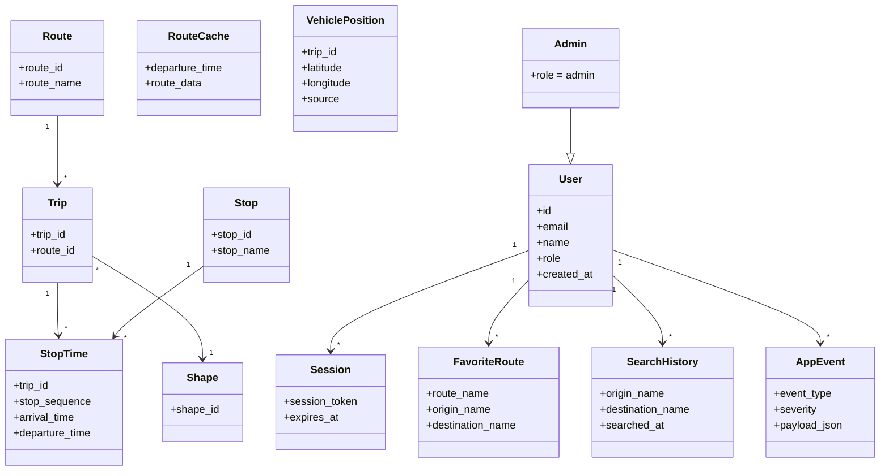

# Modelo de Domínio

```mermaid
classDiagram
    class User {
      +id
      +email
      +name
      +role
      +created_at
    }
    class Session {
      +session_token
      +expires_at
    }
    class FavoriteRoute {
      +route_name
      +origin_name
      +destination_name
    }
    class SearchHistory {
      +origin_name
      +destination_name
      +searched_at
    }
    class Route {
      +route_id
      +route_name
    }
    class Trip {
      +trip_id
      +route_id
    }
    class Stop {
      +stop_id
      +stop_name
    }
    class StopTime {
      +trip_id
      +stop_sequence
      +arrival_time
      +departure_time
    }
    class Shape {
      +shape_id
    }
    class RouteCache {
      +departure_time
      +route_data
    }
    class VehiclePosition {
      +trip_id
      +latitude
      +longitude
      +source
    }
    class Admin {
      +role = admin
    }
    class AppEvent {
      +event_type
      +severity
      +payload_json
    }

    User "1" --> "*" Session
    User "1" --> "*" FavoriteRoute
    User "1" --> "*" SearchHistory
    User "1" --> "*" AppEvent
    Admin --|> User
    Route "1" --> "*" Trip
    Trip "1" --> "*" StopTime
    Stop "1" --> "*" StopTime
    Trip "*" --> "1" Shape
```
