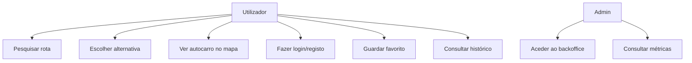
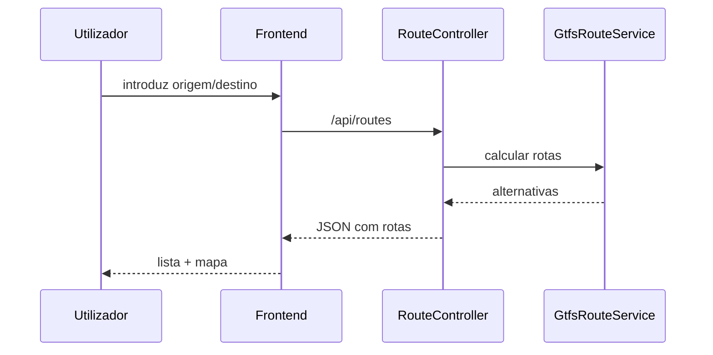
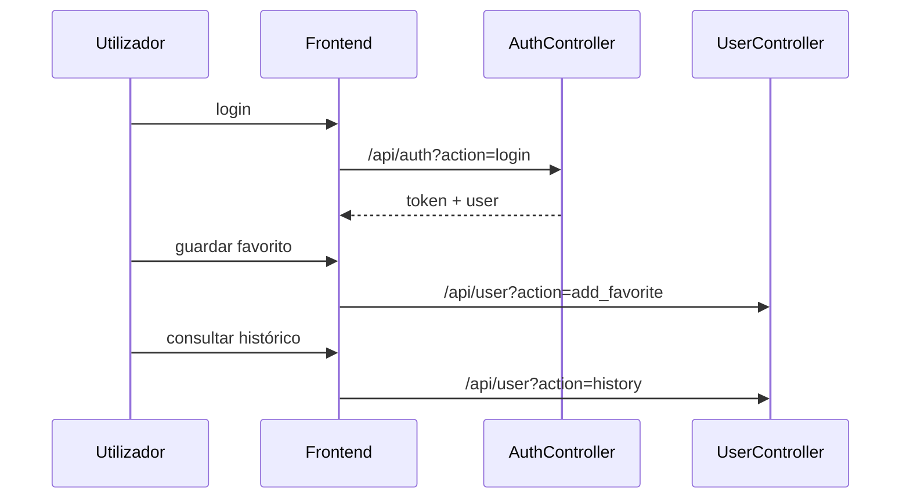
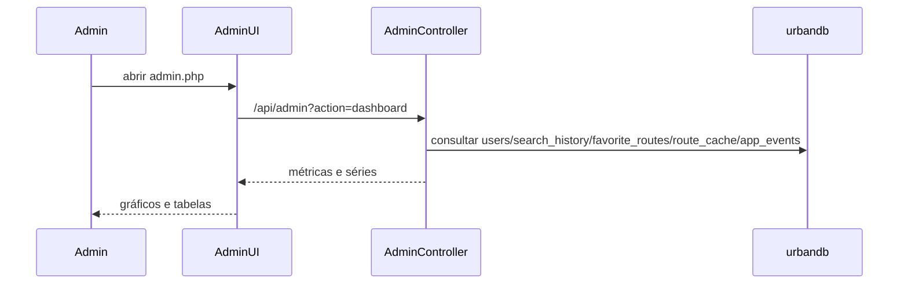

# Casos de Uso

```mermaid
flowchart TD
    User["Utilizador"] --> Search["Pesquisar rota"]
    User --> Choose["Escolher alternativa"]
    User --> Track["Ver autocarro no mapa"]
    User --> Login["Fazer login/registo"]
    User --> Favorite["Guardar favorito"]
    User --> History["Consultar histórico"]
    Admin["Admin"] --> Backoffice["Aceder ao backoffice"]
    Admin --> Metrics["Consultar métricas"]
```

## Fluxo principal de pesquisa

```mermaid
sequenceDiagram
    participant U as Utilizador
    participant F as Frontend
    participant R as RouteController
    participant G as GtfsRouteService
    U->>F: introduz origem/destino
    F->>R: /api/routes
    R->>G: calcular rotas
    G-->>R: alternativas
    R-->>F: JSON com rotas
    F-->>U: lista + mapa
```

## Fluxo de login/favoritos/histórico

```mermaid
sequenceDiagram
    participant U as Utilizador
    participant F as Frontend
    participant A as AuthController
    participant UC as UserController
    U->>F: login
    F->>A: /api/auth?action=login
    A-->>F: token + user
    U->>F: guardar favorito
    F->>UC: /api/user?action=add_favorite
    U->>F: consultar histórico
    F->>UC: /api/user?action=history
```

## Fluxo de backoffice

```mermaid
sequenceDiagram
    participant Admin
    participant AdminUI
    participant API as AdminController
    participant DB as urbandb
    Admin->>AdminUI: abrir admin.php
    AdminUI->>API: /api/admin?action=dashboard
    API->>DB: consultar users/search_history/favorite_routes/route_cache/app_events
    API-->>AdminUI: métricas e séries
    AdminUI-->>Admin: gráficos e tabelas
```
